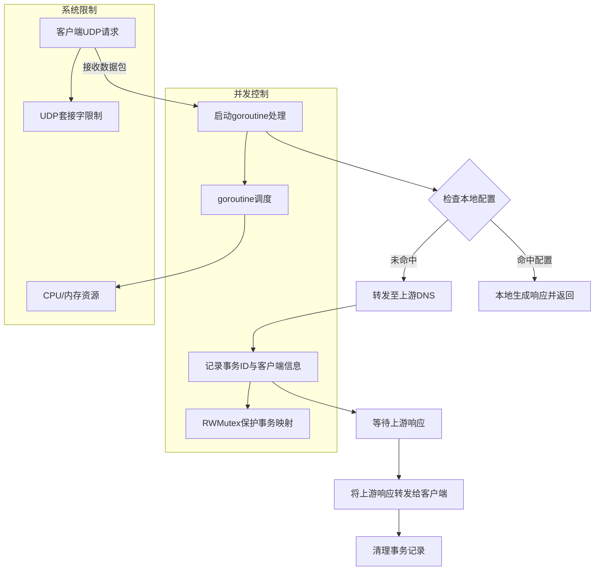

```mermaid
graph TD
    A[客户端UDP请求] -->|接收数据包| B[启动goroutine处理]
    B --> C{检查本地配置}
    C -->|命中配置| D[本地生成响应并返回]
    C -->|未命中| E[转发至上游DNS]
    E --> F[记录事务ID与客户端信息]
    F --> G[等待上游响应]
    G --> H[将上游响应转发给客户端]
    H --> I[清理事务记录]
    
    subgraph 并发控制
        B --> J[goroutine调度]
        F --> K[RWMutex保护事务映射]
    end
    subgraph 系统限制
        J --> L[CPU/内存资源]
        A --> M[UDP套接字限制]
    end
```
